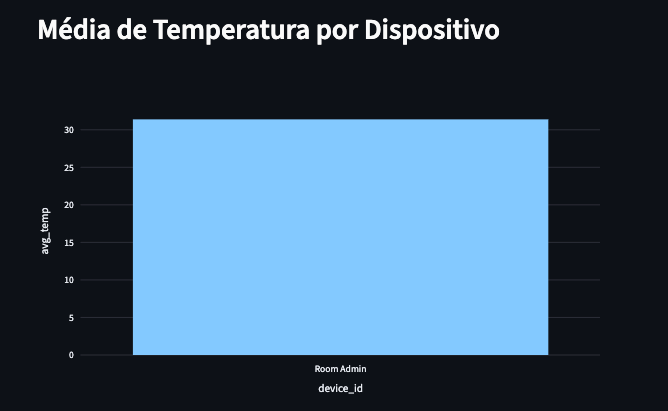
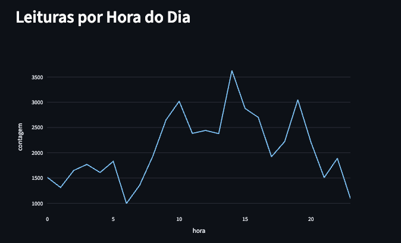

<p align="center">
  
</p>

# Pipeline de Dados com IoT, PostgreSQL, Docker e Streamlit
> *Instituição:* Centro Universitário UniFECAF  
> *Disciplina:* Disruptive Architectures: IoT, Big Data e IA  
> *Professor(a):* Vitor Jansen  
> *Autor(a):* Isabelli Moreira Romo Bastos

## Descrição do Projeto

Este projeto tem como objetivo implementar um pipeline de dados utilizando um conjunto de dados de Internet das Coisas (IoT), com foco em leituras de temperatura. O fluxo contempla desde a obtenção dos dados em formato CSV, passando pelo processo de ETL com Python, armazenamento em banco de dados PostgreSQL executado em contêiner Docker, criação de views SQL para análise e validação por meio de um dashboard interativo em Streamlit.

O dataset utilizado foi o **Temperature Readings: IoT Devices**, disponível no Kaggle. Ele contém registros de temperatura coletados por dispositivos IoT, incluindo informações como identificador da leitura, identificação da sala, data/hora do registro, temperatura e classificação da medição como interna ou externa.

## Objetivo

Desenvolver um pipeline de dados capaz de:

- ler dados brutos em CSV
- realizar limpeza e transformação dos dados
- armazenar os registros em um banco PostgreSQL
- criar views analíticas para exploração dos dados
- validar os resultados por meio de um dashboard interativo

## Tecnologias Utilizadas

As tecnologias empregadas neste projeto foram:

- **[Python](https://www.python.org/)**: linguagem principal utilizada para o desenvolvimento do processo ETL  
- **[Pandas](https://pandas.pydata.org/)**: biblioteca utilizada para leitura, limpeza, transformação e manipulação dos dados  
- **[SQLAlchemy](https://www.sqlalchemy.org/)**: biblioteca ORM utilizada para realizar a conexão entre a aplicação Python e o banco PostgreSQL  
- **[PostgreSQL](https://www.postgresql.org/)**: sistema de gerenciamento de banco de dados relacional utilizado para armazenamento dos dados  
- **[Docker](https://www.docker.com/)**: plataforma utilizada para executar o banco de dados em um contêiner isolado, garantindo portabilidade e padronização do ambiente  
- **[Streamlit](https://streamlit.io/)**: framework utilizado para construção do dashboard interativo de validação dos dados  
- **[Plotly](https://plotly.com/python/)**: biblioteca utilizada para geração de gráficos interativos dentro do dashboard  
- **[Kaggle](https://www.kaggle.com/) / [KaggleHub](https://github.com/Kaggle/kagglehub)**: plataforma utilizada para obtenção do dataset de temperatura de dispositivos IoT  

## Dataset Utilizado

O conjunto de dados utilizado foi:

**Temperature Readings: IoT Devices**

Esse dataset contém registros de temperatura associados a dispositivos/salas monitoradas, incluindo as seguintes colunas principais:

- `id`: identificador textual único da leitura
- `room_id/id`: identificação do ambiente ou dispositivo
- `noted_date`: data e hora da leitura
- `temp`: temperatura registrada
- `out/in`: classificação da leitura como interna (`In`) ou externa (`Out`)

Durante o processo ETL, algumas colunas foram renomeadas para facilitar a manipulação:

- `room_id/id` → `room_id`
- `out/in` → `location_type`

## Estrutura do Projeto

A estrutura base do projeto foi organizada da seguinte forma:

```bash
DisruptiveArchitectures/
│
├── data/
│   └── IOT-temp.csv
│
├── sql/
│   ├── 01_schema.sql
│   └── 02_views.sql
│
├── app.py
├── download_data.py
├── etl.py
├── requirements.txt
└── README.md
````

### Descrição dos Arquivos

* `data/IOT-temp.csv`
  Arquivo CSV com os dados brutos extraídos do dataset do Kaggle.

* `sql/01_schema.sql`
  Script responsável por recriar a tabela principal do banco de dados.

* `sql/02_views.sql`
  Script com a criação das views analíticas utilizadas no projeto.

* `etl.py`
  Script Python responsável pelo processo ETL: leitura do CSV, limpeza, transformação, carga no PostgreSQL e execução dos scripts SQL.

* `app.py`
  Script Streamlit responsável por exibir gráficos e tabelas para validação dos dados carregados e analisados.

* `download_data.py`
  Script para baixar o conteudo do Kaggle para uma planilha CSV no diretório `data/`.

* `requirements.txt`
  Lista das dependências Python utilizadas no projeto.

* `README.md`
  Documentação detalhada do projeto.

## Arquitetura do Pipeline

O pipeline implementado segue o fluxo abaixo:

```text
Dataset Kaggle
     ↓
Arquivo CSV
     ↓
Script ETL em Python
     ↓
PostgreSQL em Docker
     ↓
Views SQL
     ↓
Dashboard Streamlit
```

### Explicação do Fluxo

1. O dataset é obtido e armazenado localmente em formato CSV.
2. O script `etl.py` faz a leitura do arquivo.
3. Os dados passam por limpeza, padronização e transformação.
4. A tabela do PostgreSQL é recriada por meio do script SQL.
5. Os dados tratados são inseridos no banco.
6. As views analíticas são criadas.
7. O dashboard consulta essas views e exibe as análises.

## Configuração do Ambiente

### 1. Criar e ativar o ambiente virtual

No terminal, dentro da pasta do projeto:

```bash
python -m venv venv
source venv/bin/activate
```

Em sistemas Windows:

```bash
venv\Scripts\activate
```

### 2. Instalar as dependências

```bash
pip install -r requirements.txt
```

## Configuração do Banco de Dados com Docker

O banco PostgreSQL é executado em um contêiner Docker.

### Subir o contêiner PostgreSQL

```bash
docker run --name postgres-iot \
  -e POSTGRES_PASSWORD=postgres \
  -e POSTGRES_USER=postgres \
  -e POSTGRES_DB=iot_db \
  -p 5432:5432 \
  -d postgres
```

### Verificar se o contêiner está em execução

```bash
docker ps
```

### Acessar o PostgreSQL no contêiner

```bash
docker exec -it postgres-iot psql -U postgres -d iot_db
```
## Download do arquivo

## 1. Download do CSV direto do kaggle

O script `download_data.py` faz o download de um dataset do Kaggle e copia um arquivo CSV para uma pasta local denominada `data/`. O fluxo é o seguinte:

1. **Cria uma pasta `data`** (caso não exista) para armazenar arquivos.
2. **Baixa um dataset do Kaggle** usando a biblioteca **KaggleHub**.

   * Dataset usado: **Temperature Readings from IoT Devices**.
3. **Procura arquivos `.csv`** dentro da pasta do dataset baixado.
4. **Seleciona o primeiro CSV encontrado**.
5. **Copia esse CSV para a pasta `data`** com o nome `IOT-temp.csv`.
6. **Exibe no terminal** o caminho do arquivo original e o caminho final onde ele foi salvo.

✔️ Em resumo:
O script **baixa um dataset do Kaggle, localiza um arquivo CSV e o copia para uma pasta `data` do projeto com um nome padronizado**.

## Processo ETL

O script `etl.py` realiza as seguintes etapas:

### 1. Leitura do arquivo CSV

O CSV localizado em `data/IOT-temp.csv` é lido com Pandas.

### 2. Normalização dos nomes das colunas

Os nomes das colunas são convertidos para minúsculo e padronizados.

### 3. Renomeação das colunas

Para manter consistência no pipeline, duas colunas são renomeadas:

* `room_id/id` para `room_id`
* `out/in` para `location_type`

### 4. Transformações aplicadas

São realizadas as seguintes transformações:

* conversão do campo `id` para texto
* limpeza de espaços em branco
* conversão do campo `noted_date` para datetime
* conversão do campo `temp` para numérico
* padronização do campo `location_type` para minúsculo

### 5. Regras de limpeza

Os dados passam pelas seguintes regras:

* remoção de registros com campos nulos essenciais
* filtro para manter apenas `in` e `out` em `location_type`
* remoção de registros duplicados com base na coluna `id`

### 6. Recriação da tabela

O script executa `sql/01_schema.sql`, responsável por remover e recriar a tabela principal com `CASCADE`, garantindo consistência a cada carga.

### 7. Inserção dos dados

Após a criação da tabela, os registros tratados são inseridos no PostgreSQL.

### 8. Criação das views

Ao final, o script executa `sql/02_views.sql` para disponibilizar as views analíticas no banco.

## Esquema da Tabela Principal

A tabela principal criada no PostgreSQL é:

```sql
CREATE TABLE iot_temperature_readings (
    id TEXT PRIMARY KEY,
    room_id VARCHAR(100),
    noted_date TIMESTAMP,
    temp NUMERIC(10,2),
    location_type VARCHAR(10)
);
```

### Justificativa do Tipo da Coluna `id`

Embora inicialmente fosse esperado um identificador numérico, o dataset possui IDs textuais, como por exemplo:

```text
__export__.temp_log_196134_bd201015
```

## Views Criadas

O projeto inclui três views analíticas principais utilizadas pelo dashboard.

### 1. `avg_temp_por_dispositivo`

Calcula a **temperatura média por dispositivo (sala)**, permitindo identificar quais ambientes apresentam temperaturas mais altas ou mais baixas.

### 2. `leituras_por_hora`

Mostra a **quantidade de leituras registradas por hora do dia**, ajudando a entender a distribuição das medições ao longo do tempo.

### 3. `temp_max_min_por_dia`

Apresenta a **temperatura máxima e mínima registrada em cada dia**, permitindo acompanhar variações térmicas ao longo do período monitorado.

Essas views são utilizadas diretamente pelo dashboard desenvolvido com **Streamlit**, que consulta os dados armazenados no **PostgreSQL** e gera visualizações interativas utilizando **Plotly**.

## Dashboard Streamlit

O dashboard foi criado para validar o processo e visualizar os dados de forma simples.

### Principais gráficos do dashboard

#### Média de temperatura por dispositivo/sala


#### Contagem de leituras por hora


### Temperaturas máximas e mínimas por dia


### Executar o dashboard

```bash
streamlit run app.py
```

Após executar, o Streamlit abrirá uma interface no navegador, normalmente em:

```text
http://localhost:8501
```

## Como Executar o Projeto Completo

### Passo 1: ativar o ambiente virtual

```bash
source venv/bin/activate
```

### Passo 2: subir o PostgreSQL no Docker

```bash
docker run --name postgres-iot \
  -e POSTGRES_PASSWORD=postgres \
  -e POSTGRES_USER=postgres \
  -e POSTGRES_DB=iot_db \
  -p 5432:5432 \
  -d postgres
```

### Passo 3: executar o ETL

```bash
python etl.py
```

Se tudo estiver correto, a saída esperada será semelhante a:

```text
Lendo arquivo: /caminho/do/projeto/data/IOT-temp.csv
Total bruto no CSV: 97606
Registros após limpeza: 49943
Executando 01_schema.sql
Executando 02_views.sql
Carga finalizada com 49943 registros.
```

### Passo 4: executar o dashboard

```bash
streamlit run app.py
```

## Consultas de Validação no Banco

Alguns comandos úteis para validação no PostgreSQL:

### Listar as tabelas

```sql
\dt
```

### Listar as views

```sql
\dv
```

### Consultar a tabela principal

```sql
SELECT * FROM iot_temperature_readings LIMIT 10;
```

### Consultar média por localização

```sql
SELECT * FROM vw_avg_temp_by_location;
```

### Consultar resumo diário

```sql
SELECT * FROM vw_daily_temp_summary LIMIT 10;
```

## Resultados Obtidos

O pipeline conseguiu:

* carregar o dataset bruto em CSV
* realizar limpeza e padronização dos dados
* persistir os dados em PostgreSQL
* estruturar consultas analíticas com views
* disponibilizar visualização por meio de dashboard

Isso demonstra a construção de um pipeline de dados completo, com etapas de ingestão, transformação, armazenamento, modelagem analítica e visualização.

## Principais Aprendizados

Durante o desenvolvimento, alguns pontos importantes foram identificados:

* necessidade de validar o tipo real das colunas do dataset
* importância da padronização dos nomes dos campos
* necessidade de controlar dependências entre tabela e views
* importância de organizar a carga em etapas previsíveis
* uso de Docker para padronização do ambiente do banco

## Dificuldades Encontradas

Ao longo do desenvolvimento, foram observados alguns desafios:

* conflito de porta `5432` já utilizada na máquina
* diferenças entre o tipo esperado e o tipo real da coluna `id`
* erro ao recriar views existentes com estrutura diferente
* necessidade de usar `CASCADE` para remover dependências entre tabela e views
* necessidade de adaptar o dashboard às views realmente existentes no banco

## Possíveis Melhorias Futuras

Como evolução do projeto, podem ser implementadas as seguintes melhorias:

* uso de `docker-compose` para facilitar a subida dos serviços
* modularização maior do ETL em arquivos separados
* adição de logs estruturados
* criação de testes automatizados
* versionamento do schema do banco
* inclusão de mais métricas analíticas
* containerização também do dashboard Streamlit

## Principais Insights e Aplicações Práticas

A análise das leituras de temperatura dos dispositivos IoT permitiu identificar alguns padrões importantes.

### Insights Obtidos

* **Diferença entre ambientes internos e externos:** temperaturas externas apresentam maior variação ao longo do dia, enquanto ambientes internos tendem a ser mais estáveis.
* **Ciclo térmico diário:** as temperaturas geralmente são mais baixas pela manhã, aumentam ao longo do dia e atingem o pico no período da tarde.
* **Comportamento por ambiente:** algumas salas apresentam médias de temperatura diferentes, o que pode indicar fatores como ventilação, incidência solar ou presença de equipamentos que geram calor.
* **Regularidade das medições:** a frequência constante das leituras indica que o sistema de coleta de dados é consistente.

### Possíveis Aplicações em Cenários Reais

O pipeline desenvolvido pode ser aplicado em diversos contextos de monitoramento com sensores IoT, como:

* **edifícios inteligentes**, para otimizar sistemas de climatização e reduzir consumo de energia
* **ambientes industriais**, para monitoramento de equipamentos e prevenção de superaquecimento
* **cadeia fria**, no controle de temperatura de alimentos, vacinas e medicamentos
* **agricultura de precisão**, para monitoramento ambiental em estufas ou plantações

Essas aplicações demonstram como pipelines de dados com sensores IoT podem apoiar decisões operacionais e melhorar o controle de ambientes monitorados.


## Conclusão

O projeto atingiu o objetivo de construir um pipeline de dados aplicado a um contexto de IoT. Foi possível extrair dados de um dataset real, tratá-los com Python, armazená-los em PostgreSQL executado em Docker, criar views para análise e validar os resultados em um dashboard.

Além de atender aos requisitos propostos, o projeto também proporcionou experiência prática com integração entre diferentes ferramentas amplamente utilizadas em engenharia de dados, análise de dados e visualização.